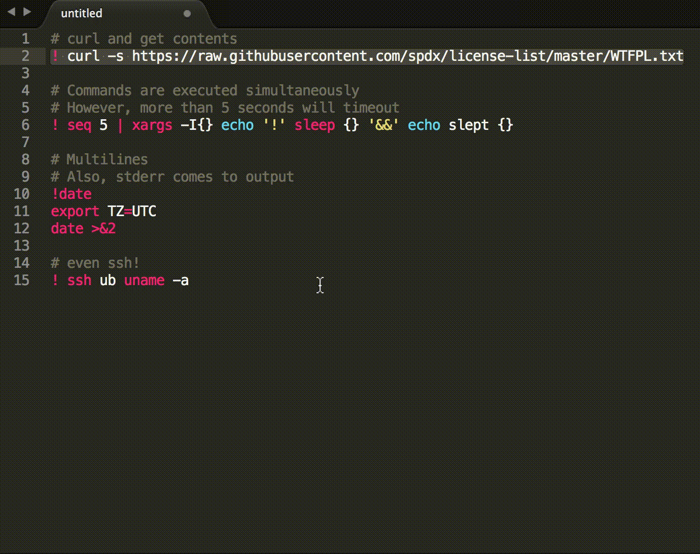

# Sublime Evaluate [](https://www.gittip.com/jbrooksuk/)
A powerful plugin which returns the value of selected regions.

# Evaluation Environment
Sublime Evaluate is able to evaluate the `math` and `datetime` import as part of its enviroment. This opens up access to a whole range of Python functions such as:

```python
math.atan2(80, 40)

math.pi * 60

datetime.date(2013,4,2) # Returns a formatted date

datetime.date.today()
```

We can also perform morecomplex expressions such as:

```python
(math.pi * 2) / math.pi * 0.5
```

# Evaluate Shell Script
Sublime Evaluate also supports evaluating code as shell script, Just add a `!` at the beginning:

```bash
! echo hello         # > hello

! ! true; echo $?    # > 1

# Even multilines
! for i in `seq 10`; do
  echo I got a $i
done

```

#### Current Working Dir
Current working dir is the Sublime install dir. You can get it with a `!pwd`.

#### Stderr
Stderr is captured as well as stdout.

#### Timeout
Currently a 5s timeout is set. You code will be terminated when it runs more than 5s.

#### OS/Sublime Support
Though the it is supposed to work on all OSs / Sublime 2/3, this feature is tested on macOS + Sublime 3.

Please kindly report to us if you find an issue. We'd be happy to fix it.

#### Demo


# License
MIT - [http://jbrooksuk.mit-license.org](http://jbrooksuk.mit-license.org)
